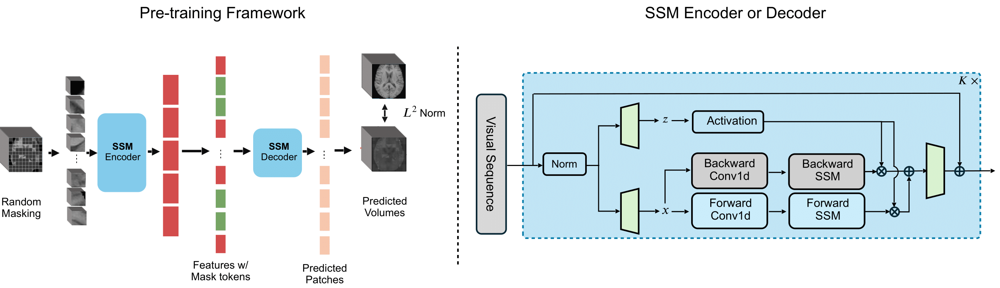

# 3D Mamba MAE 
## Abstract
<p align="justify">
Learning meaningful and interpretable representations from high-dimensional volumetric magnetic resonance (MR) images is essential for advancing personalized medicine. While Vision Transformers (ViTs) have shown promise in handling image data, their application to 3D multi-contrast MR images faces challenges due to computational complexity and interpretability. To address this, we propose a novel state-space-model (SSM)-based masked autoencoder which scales ViT-like models to handle high-resolution data effectively while also enhancing the interpretability of learned representations. We propose a latent-to-spatial mapping technique that enables direct visualization of how latent features correspond to specific regions in the input volumes in the context of SSM. We validate our method on two key neuro-oncology tasks: identification of isocitrate dehydrogenase mutation status and 1p/19q co-deletion classification, achieving state-of-the-art accuracy. Our results highlight the potential of SSM-based self-supervised learning to transform radiomics analysis by combining efficiency and interpretability.
</p>

<!--  -->
<!--  -->

<p align="center">
    
    <figcaption>
    <b>Left</b>: Pre-training a state space model to learn effective representations for 3D multi-contrast MR images. 
    <b>Right</b>: Details of the SSM encoder and decoder. All the vanilla ViT's attention blocks in MAE are replaced by SSM blocks, while preserving the same pre-training strategy by random masking and reconstruction. The scaled architecture effectively captures global representations for high-resolution data.</figcaption>
</p>


## Results under different patch sizes

5-fold cross-validation results for IDH mutation status classification and 1p/19q co-deletion classification using linear scaled model across different patch sizes $$p \in  \{4，16，32 \}$$:
| Patch size | Sequence length | Accuracy (IDH) | F1-score (IDH) | AUC (IDH) | Accuracy (1p/19q) | F1-score (1p/19q) | AUC (1p/19q) |
|------------|-----------------|----------------|----------------|-----------|-------------------|-------------------|--------------|
| 32         | 125             | 0.978                      | 0.967                | 0.997          | 0.896                      | 0.797                | 0.947          |
| 16         | 1000            | 0.988                      | 0.980                | 0.997          | 0.911                      | 0.827                | 0.944          |
| 4          | 64000           | **0.998**                  | **0.997**            | **0.999**      | **0.911**                  | **0.832**            | **0.958**      |


## Installing the dependencies
  After you clone the project from github, and then please install the dependencies using the following commands:

  ```
  conda create -n vim python=3.10
  conda activate vim
  conda install pytorch==2.1.2 torchvision==0.16.2 torchaudio==2.1.2 pytorch-cuda=12.1 -c pytorch -c nvidia
  conda install cuda -c nvidia/label/cuda-12.1.0
  pip install -r vim_requirements.txt
  pip install -e mamba2
  pip install tensorboard torchio rotary-embedding-torch openpyxl
  ```


## Dataset Description
- In this work, we use Brats2022 dataset for pre-training and EGD dataset for fine-tuning. 
- After you have downloaded the data, please remember to process them into ```160 x 160 x 160``` volumes and make sure the data value is integer and the range is [0, 255]. 
- Create a file named ```config.ini```, with the following content: 
  ```
  [brats_160]
  BASE_PATH = "your preprocessed brats2022 path"
  TEST_BASE_PATH = "your preprocessed egd path"
  ```


## Pre-training

Please note that both pre-training and fine-tuning stages require at least 24GB GPU memory for models with path size 4. 

To pre-training the model, please use the following script:
```
python -m torch.distributed.launch --nproc_per_node=4 --master_port=27590 --use_env main_pretrain.py --model mae_3d_vim_small_patch4 --batch_size 4  --norm_pix_loss --mask_ratio 0.75 --epochs 1000 --warmup_epochs 40 --blr 2.5e-4 --weight_decay 0.05 --use_3d --name_dataset brats-160  --input_size 160 --seed 42 --output_dir vim_small_brats_160_patch4 --log_dir vim_small_brats_160_patch4  --num_workers 8 --use_z_score --pin_mem
```
**NOTE**: To train models with other patch sizes, you just need to change the model name. If you don't have enough RAM, you can use ```--no_pin_men``` flag to reduce the RAM computation

Moreover, we provide three pre-trained checkpoints under different patch sizes (4, 16, 32) for you: 
| Patch size | Pre-trained weight |
|:----------:|:------------------:|
|      4     |          https://drive.google.com/drive/folders/1CsQlO04wXHrxRIe-XLpioAg0AUSHyde2?usp=sharing          |
|     16     |       https://drive.google.com/drive/folders/1GxOGlYmG1YR6xRmieUoSY7yWYWzhXsaI?usp=sharing             |
|     32     |        https://drive.google.com/drive/folders/1rjJcStq9PzVmlum1qkJwvjNHqsja7TUA?usp=sharing            |

After you download the pre-trained weight, please unzip the file and put folder in your main directory. 
## Finetuning script with 5-fold cross-validtion 

To evaluate the model performance on 1p/19q co-deletion classification, the launch script are as follows:
```
python -m torch.distributed.launch --nproc_per_node=4 --master_port=27590 --use_env main_cr_finetune.py --model vim_3D_small_patch4_stride4_224_bimambav2_final_pool_mean_abs_pos_embed_div2  --batch_size 2  --epochs 100   --name_dataset brats-160  --lr 1e-4 --weight_decay 0.05 --input_size 160 --seed 42 --finetune vim_small_brats_160_patch4/checkpoint-999.pth --nb_classes 2 --output_dir vim_small_brats_160_patch4_cr --log_dir vim_small_brats_160_patch4_cr --use_scheduler --use_3d --use_z_score --label_type 1p19q --k_fold 5
```

**NOTE**: If you want to evaluate on IDH classification task, please remove ```--label_type 1p19q``` flag. You may want to change the number of gpus used in the scripts and the patch sizes in the scripts as well.

## Visualization
To visualize the pre-trained model, you just need to run the following command:
```
cd vis/
python visualize.py
```

To visualize your own fine-tuned model, you just need to run the following command:
```
cd vis/
python visualize_finetuned.py
```

## Citation
```
@misc{hu2024learningbraintumorrepresentation,
      title={Learning Brain Tumor Representation in 3D High-Resolution MR Images via Interpretable State Space Models}, 
      author={Qingqiao Hu and Daoan Zhang and Jiebo Luo and Zhenyu Gong and Benedikt Wiestler and Jianguo Zhang and Hongwei Bran Li},
      year={2024},
      eprint={2409.07746},
      archivePrefix={arXiv}
}
```

## Acknowledgement

This training framework and the MoCoV3 pre-training framework is built upon [MAE](https://github.com/facebookresearch/mae).

The Mamba models are built upon [Mamba](https://github.com/state-spaces/mamba) and [Vision Mamba](https://github.com/hustvl/Vim).

The evaluation code and MoCoV3 training code is from [vit_ae_plus_plus](https://github.com/chinmay5/vit_ae_plus_plus).

Some part of the MoCoV3 finetuning code is from [DeiT](https://github.com/facebookresearch/deit).

Thanks for their wonderful open-source works.

